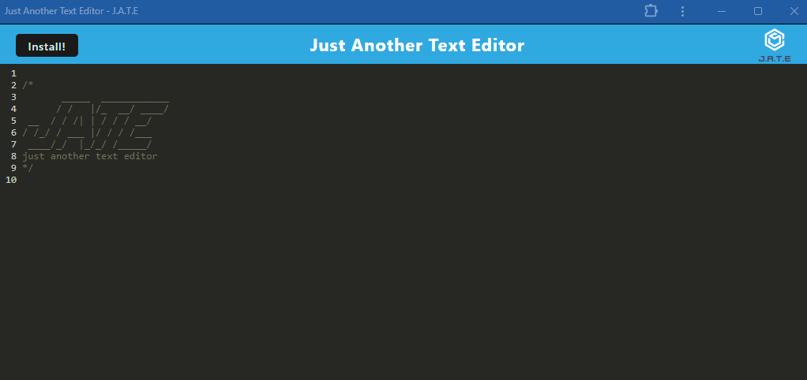
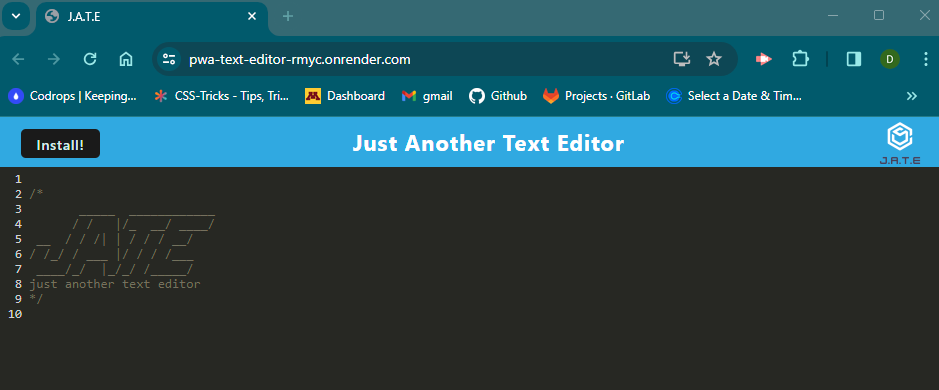

# pwa-text-editor

A pwa enabled text editor.

# pwa-text-editor-JATE

## Description

A pwa enabled text editor, using express, webpack and js.

## Table of Contents

- [Installation](#installation)
- [Usage](#usage)
- [Credits](#credits)
- [Contributing](#contributing)
- [Tests](#tests)
- [Questions](#questions)
- [License](#license)

## Installation

run 'npm run install' and start using 'npm run start'

## Usage

Uses indexedDB to store entered text. Application can be installed locally using the install button.

Link to deployed page: https://pwa-text-editor-rmyc.onrender.com/

## Credits

Starter code provided by UofM bootcamp.

## Contributing

N/A

## Tests

N/A

## Questions

Please contact me at [treblotnad@gmail.com](mailto:treblotnad@gmail.com) or [treblotnad](github.com/treblotnad) with any questions!

## License

This project is licensed under the MIT License - see the License file for details.
